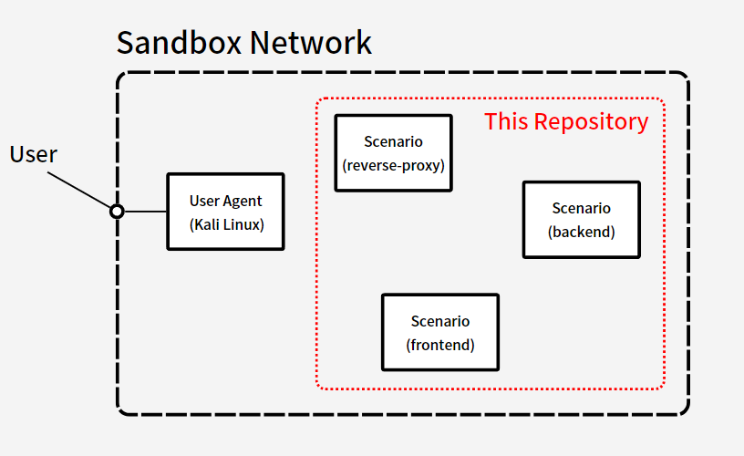

# シナリオ作成虎の巻

シナリオは、演習のできる環境のみを提供するイメージです。

サンドボックス内ではシナリオを`docker compose up`した後に、同一ネットワークに[userAgent](https://github.com/shin-lab-sec/cyber-range-server/tree/master/express/userAgent) が注入されるので、ユーザー用アクセスポート番号などは考える必要はありません。

## 仕様など

- `.env`, `docker-compose.yml`, `cypas.json5`は必須
- `docker compose up` で起動できる必要がある
- `docker-compose.yml`内の image 名は`<scenario名>/<service名>`に固定。例は[sample-scenario](https://github.com/tosssssy/sample-scenario/blob/master/docker-compose.yml)参照

## イメージ

